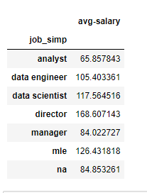
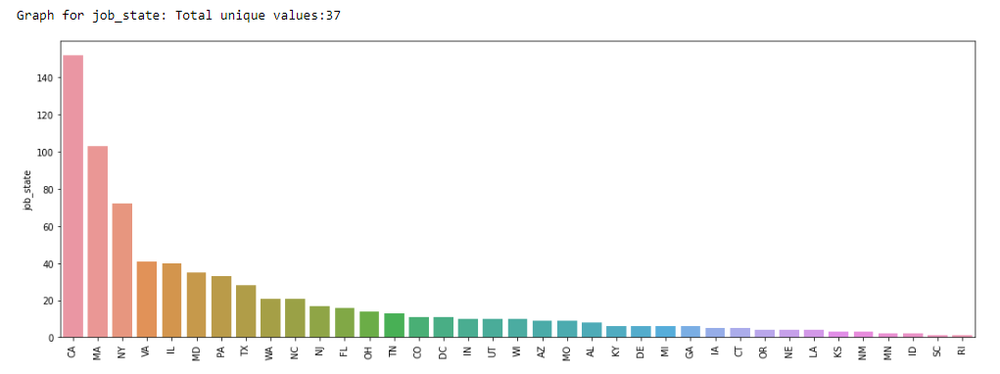
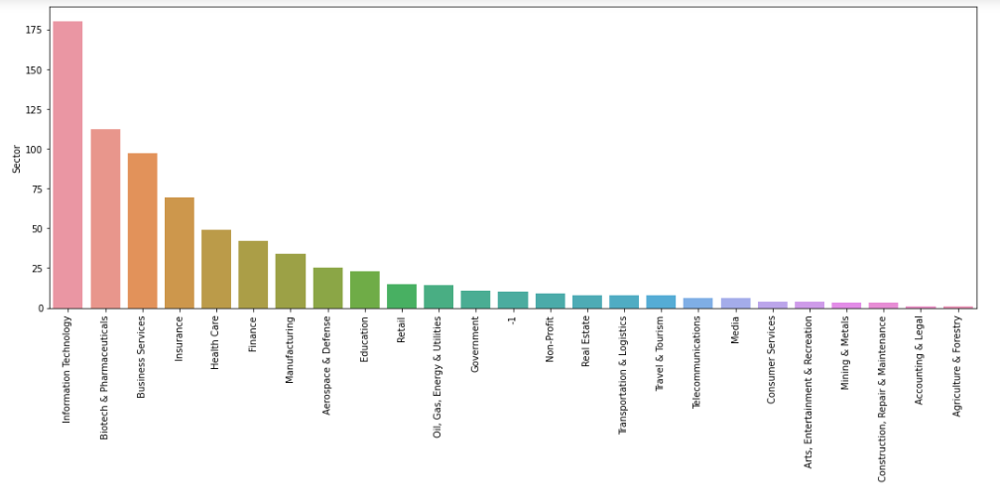

# Data Science Salary Estimator : Project Overview

* Created a tool that estimates data science salaries (MAE ~ $ 11K) to help data scientists negotiate their income when they get a job.
* Scraped arount 1000 job descriptions from glassdoor using Python and Selenium
* Engineered features from the text of job description to quantify the value companies put on Python, Excel, AWS, Spark.
* Optimized Linear, Lasso and Random Forest regressors using GridSearchCV to reach the best model.
* Built a client facing API using flask

## Code and Resources Used

**Python Version:**  3.8\
**Packages:**  pandas, numpy, sklearn, matplotlib, seaborn, selenium, flask, json, pickle\
**Scraper article:**  https://mersakarya.medium.com/selenium-tutorial-scraping-glassdoor-com-in-10-minutes-3d0915c6d905  
**Flask Productionization:**  https://towardsdatascience.com/productionize-a-machine-learning-model-with-flask-and-heroku-8201260503d2

## Web Scraping

Scraped around 1000 job postings from glassdoor.com. With each job, we got following:
* Job title
* Salary Estimate
* Job Description
* Rating
* Company
* Location
* Company Headquarters
* Company Size
* Company Founded Date
* Type of ownership
* Industry
* Sector
* Revenue
* Competitors

## Data Cleaning

After scraping the data, we needed to clean it up so that it was usable for our model. We made the following changes and created following variables:

* Parsed numeric data out of salary
* Made columns for employer provided salary and hourly wages
* Removed rows without salary
* Parsed rating out of company text
* Made a new column for company state
* Added a column for if the job was at the company’s headquarters
* Transformed founded date into age of company
* Made columns for if different skills were listed in the job description:

  * Python
  * R
  * Excel
  * AWS
  * Spark
* Column for simplified job title and Seniority
* Column for description length

## EDA

We looked at the distributions of the data and the value counts for the various categorical variables. Below are a few highlights from the pivot tables.\

